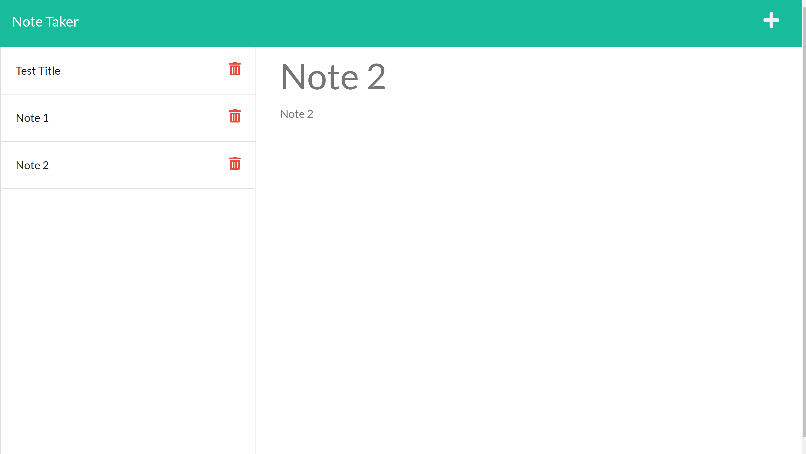

# Note Taker

This project contains a simple note taker. The user can enter a name for their note, along with a description, to store quick snippets of information. This is stored in a json file that is recalled when the page is refreshed.

Languages/Libraries used:
-
* HTML
* JavaScript
* Node.js
* uuid
* Express.js
* CSS

## Table Of Contents
* [Installation](#Installation)
* [Usage](#Usage)
* [License](#License)
* [Contributing](#Contributing)
* [Tests](#tests)
* [Questions](#Questions)
## Installation

Install project by cloning the repo into the directory you want the project to be stored in. Open your terminal and run 'npm install' in order to download dependencies.
    
## Usage/Examples

* Give your note a name
* Add a description
* Click the floppy disk to save

## License

[MIT](https://choosealicense.com/licenses/mit/)

## Contributing

This project is not currently open for contribution. If you have any questions or concerns, please make a post in the issues section.

## Authors

- [@noothanks](https://www.github.com/noothanks)

##Image

